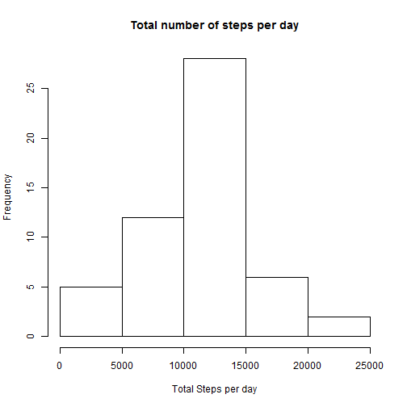
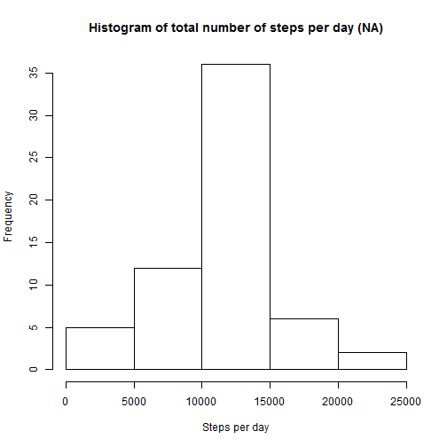
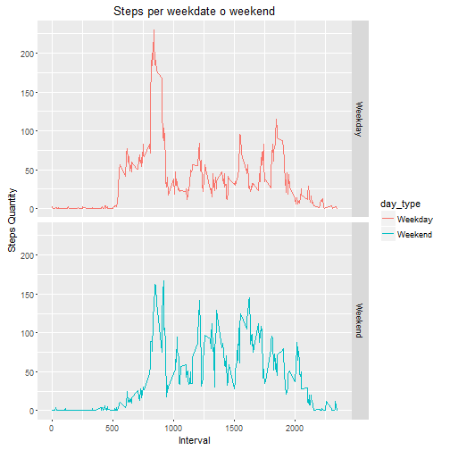

## Introduction

It is now possible to collect a large amount of data about personal movement using activity monitoring devices such as a Fitbit, Nike Fuelband, or Jawbone Up. These type of devices are part of the "quantified self" movement -- a group of enthusiasts who take measurements about themselves regularly to improve their health, to find patterns in their behavior, or because they are tech geeks. But these data remain under-utilized both because the raw data are hard to obtain and there is a lack of statistical methods and software for processing and interpreting the data.

This assignment makes use of data from a personal activity monitoring device. This device collects data at 5 minute intervals through out the day. The data consists of two months of data from an anonymous individual collected during the months of October and November, 2012 and include the number of steps taken in 5 minute intervals each day.

## Data source

The data for this assignment can be downloaded from the course web site:

Dataset: Activity monitoring data [52K]
The variables included in this dataset are:

steps: Number of steps taking in a 5-minute interval (missing values are coded as NA)

date: The date on which the measurement was taken in YYYY-MM-DD format

interval: Identifier for the 5-minute interval in which measurement was taken

The dataset is stored in a comma-separated-value (CSV) file and there are a total of 17,568 observations in this dataset.


## Loading and preprocessing the data

Show any code that is needed to

1. Load the data (i.e. read.csv())
2. Process/transform the data (if necessary) into a format suitable for your analysis


```r
setwd("C:/SD Storage/Dropbox/work/Coursera/Data Science/Reproducible Research")


library(ggplot2)

# Loading the data  into a data frame
activity <- read.csv("activity.csv", as.is = TRUE)

# Clear the data of the null cases
activity_not_NA <- activity[complete.cases(activity), ]
```


## What is mean total number of steps taken per day?

For this part of the assignment, you can ignore the missing values in the dataset.

1. Make a histogram of the total number of steps taken each day

2. Calculate and report the mean and median total number of steps taken per day


```r
# how many steps per day
steps_per_day <- aggregate(steps ~ date, activity_not_NA, sum)

# Create a basic graph for showing the steps per day
hist(steps_per_day$steps, main = "Total number of steps per day", xlab = "Total Steps per day")
```



```r
# Calculate the mean and median 
round(mean(steps_per_day$steps))
```

```
## [1] 10766
```

```r
median(steps_per_day$steps)
```

```
## [1] 10765
```


## What is the average daily activity pattern?

1. Make a time series plot (i.e. type = "l") of the 5-minute interval (x-axis) and the average number of steps taken, averaged across all days (y-axis)

2. Which 5-minute interval, on average across all the days in the dataset, contains the maximum number of steps?


```r
# Avarage steps per day 
avg_steps_per_interval <- aggregate(steps ~ interval, activity_not_NA, mean)


# which contains the maximum number of steps
interval_idx <- which.max(avg_steps_per_interval$steps)

# which contains the maximum number of steps
print (paste("The highest avg steps is in Interval ", avg_steps_per_interval[interval_idx, ]$interval))
```

```
## [1] "The highest avg steps is in Interval  835"
```


## Imputing missing values

Note that there are a number of days/intervals where there are missing values (coded as NA). The presence of missing days may introduce bias into some calculations or summaries of the data.

1. Calculate and report the total number of missing values in the dataset (i.e. the total number of rows with NAs)

2. Devise a strategy for filling in all of the missing values in the dataset. The strategy does not need to be sophisticated. For example, you could use the mean/median for that day, or the mean for that 5-minute interval, etc.

3. Create a new dataset that is equal to the original dataset but with the missing data filled in.

4. Make a histogram of the total number of steps taken each day and Calculate and report the mean and median total number of steps taken per day. Do these values differ from the estimates from the first part of the assignment? What is the impact of imputing missing data on the estimates of the total daily number of steps?


```r
# Calculate the number of rows with missing values
total_rows_na <- activity[!complete.cases(activity), ]
nrow(total_rows_na)
```

```
## [1] 2304
```

```r
# Devise a strategy for filling in all of the missing values in the dataset

for (i in 1:nrow(activity)) {
    if(is.na(activity$steps[i])) {
        val <- avg_steps_per_interval$steps[which(avg_steps_per_interval$interval == activity$interval[i])]
        activity$steps[i] <- val 
    }
}

# Create a new dataset that is equal to the original dataset but with the missing data filled in
steps_per_day_not_na <- aggregate(steps ~ date, activity, sum)


# Draw a histogram 
hist(steps_per_day_not_na$steps, main = "Histogram of total number of steps per day (NA)", xlab = "Steps per day")
```



```r
# Compute the mean 
round(mean(steps_per_day_not_na$steps))
```

```
## [1] 10766
```

```r
# Compute the median
median(steps_per_day_not_na$steps)
```

```
## [1] 10766.19
```


## Are there differences in activity patterns between weekdays and weekends?

For this part the weekdays() function may be of some help here. Use the dataset with the filled-in missing values for this part.

1. Create a new factor variable in the dataset with two levels -- "weekday" and "weekend" indicating whether a given date is a weekday or weekend day.

2. Make a panel plot containing a time series plot (i.e. type = "l") of the 5-minute interval (x-axis) and the average number of steps taken, averaged across all weekday days or weekend days (y-axis). The plot should look something like the following, which was created using simulated data:


```r
check_is_week_day <- function(date_val) {
    wd <- weekdays(as.Date(date_val, '%Y-%m-%d'))
    if  ((wd == 'Saturday' || wd == 'Sunday')) {
        day_type <- 'Weekend'
    } else {
        day_type <- 'Weekday' 
    }
    
    day_type
}


# put the correct day type for weekends and weekday
activity$day_type <- as.factor(sapply(activity$date, check_is_week_day))


# Aggregate data by day_type
steps_per_day_type <- aggregate(steps ~ interval+day_type, activity, mean)

# Make a panel plot containing a time series plot 
plt <- ggplot(steps_per_day_type, aes(interval, steps)) +
    geom_line(stat = "identity", aes(colour = day_type)) +
    theme_gray() +
    facet_grid(day_type ~ ., scales="fixed", space="fixed") +
    labs(x="Interval", y=expression("Steps Quantity")) +
    ggtitle("Steps per weekdate o weekend")


print(plt)
```




